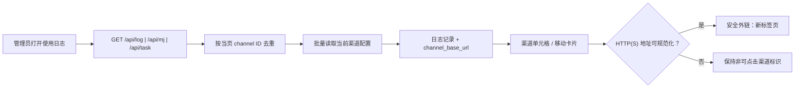

# 技术设计：统一渠道外部站点跳转

## 设计结论

以“管理员日志列表响应增加当前渠道地址 + 前端共享安全链接工具”实现本需求。日志不保存地址快照，后端在响应当前页时批量补全，前端以与模型路由相同的安全归一化函数决定是否渲染锚点。



## 前端边界

### 共享 URL 规则

当前 `web/default/src/features/model-route/index.tsx` 与 `web/default/src/features/model-route/components/policy-sortable-group.tsx` 各自实现了同一套 `normalizeExternalUrl`。将其提取为 default 前端的通用工具（建议 `web/default/src/lib/external-url.ts`），对外只暴露：

```ts
normalizeExternalUrl(raw?: string): string
```

工具保持以下兼容语义：

- 修剪空白；接受显式 `http:` / `https:`。
- `//host/path` 变为 `https://host/path`。
- 既有裸域名正则匹配时补 `https://`。
- 其他输入返回空字符串。

模型路由的策略和指标链接、使用日志的新链接均调用该工具。这是保持“行为一致”的单一真源；不得在使用日志中复制正则或放宽协议规则。

### 使用日志渠道单元格

建议新增使用日志内部可复用的 `ChannelLinkBadge`（位置可在 `components/columns/` 或特性级共享组件），输入至少为：

```ts
{ channelId: number; baseUrl?: string; label?: string }
```

- `href` 非空时，用 `<a>` 包裹现有 badge/标签，采用模型路由相同的外链属性和链接视觉。
- `href` 为空或渠道 ID 无效时，保留当前 `StatusBadge` 或 `-` 占位，不渲染无效锚点。
- 公共单元格替换 `column-helpers.tsx` 的 `createChannelColumn`，使绘图日志和任务日志自动覆盖。
- 通用日志的定制 `ChannelCell` 将其 `#id` 徽标替换为该组件，同时保留 `multi_key_index`、重试链 Popover、渠道亲和性按钮及 Tooltip。
- 由于移动卡片通过 `flexRender` 复用 TanStack 表格单元格，改造列定义即可同步覆盖移动端；实现后仍需做实际视图回归验证。

### 前端类型契约

以下字段均为可选字符串，缺失时安全降级：

| 前端类型 | 新字段 |
| --- | --- |
| `UsageLog`（`data/schema.ts`） | `channel_base_url` |
| `MidjourneyLog`（`types.ts`） | `channel_base_url` |
| `TaskLog`（`types.ts`） | `channel_base_url` |

该字段不应作为用户可编辑数据，也不影响日志查询缓存键、筛选条件或页面路由参数。

## 后端边界与接口契约

### 增量响应字段

管理员接口对每个记录可选新增：

```json
{
  "channel": 12,
  "channel_name": "Example upstream",
  "channel_base_url": "https://api.example.com/v1"
}
```

绘图和任务日志沿用自身 `channel_id` 字段，再额外返回 `channel_base_url`。字段缺失、空字符串或 `null` 均等价于前端不生成链接；建议服务端统一使用空字符串，便于现有 TypeScript 默认值处理。

| 管理员接口 | 补全对象 | 约束 |
| --- | --- | --- |
| `GET /api/log` | `model.Log` | 保留既有 `channel_name`，新增 `channel_base_url` |
| `GET /api/mj` | `model.Midjourney` | 新增非持久化 `channel_base_url` |
| `GET /api/task` | 管理员专用 `dto.TaskDto` 列表 | 新增 `channel_base_url` |

`/api/log/self`、`/api/mj/self`、`/api/task/self` 不返回该字段。尤其 `relay.TaskModel2Dto` 也服务于任务查询等对外响应，不能无条件在通用 DTO 中填入地址；管理员列表须在控制器的专用装配步骤中补全。

### 批量解析

实现一个可复用的管理员展示信息解析器，输入为当页渠道 ID 集合，输出 ID 到 `{ name, baseURL, exists }` 的映射。它应：

1. 过滤非正数、去重 ID。
2. 开启内存缓存时优先使用 `CacheGetChannel`，未命中或未开启缓存时一次性使用 `GetChannelsByIds` 获取剩余渠道。
3. 使用 `Channel.GetBaseURL()` 取得与模型路由一致的地址，而非直接依赖可空数据库字段。
4. 将不存在的渠道视为非致命缺失，不中断日志列表。

通用日志现有的 `GetAllLogs` 已批量补渠道名称，扩展其映射即可。绘图与任务日志在管理员控制器响应装配阶段调用同一解析器；避免三个控制器各自实现渠道查询。

## 安全、兼容与回滚

- 只产生 HTTP(S) 外链，配合 `noopener noreferrer` 隔离新页面的 `window.opener`。
- 新字段为管理员接口的向后兼容增量；旧前端忽略它，新前端面对旧后端仍显示原来的非可点击标识。
- 不修改持久化模型列，不需要数据库迁移，也不回填历史日志。
- 回滚时可先撤回前端渲染，遗留的可选响应字段不会影响旧客户端；若需要完全回滚，再移除管理员装配字段。

## 关键风险与处理

| 风险 | 处理 |
| --- | --- |
| 复制 URL 规则导致模型路由与日志表现不同 | 将归一化函数抽为共享工具并对其直接测试 |
| 将地址意外放进用户 API 或通用任务 DTO | 管理员接口专用装配；自助接口作负向断言 |
| 一页日志触发多次渠道查询 | 一次收集/去重/批量解析，并以测试或 mock 断言次数 |
| 已删除、为空或非法渠道地址造成错误跳转 | 允许地址缺失并只显示非链接文本 |
| 通用日志复杂单元格的按钮互相干扰 | 链接、亲和性按钮、重试链 Popover 分别验证点击和键盘行为 |
